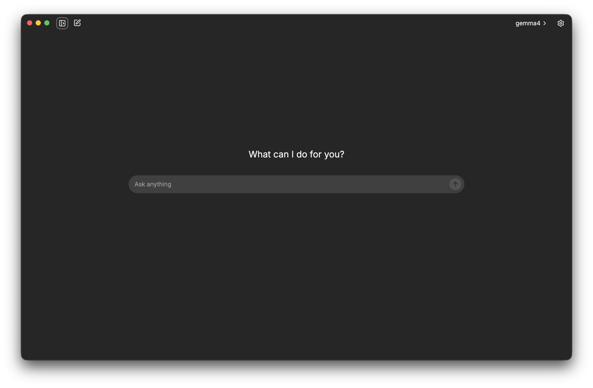
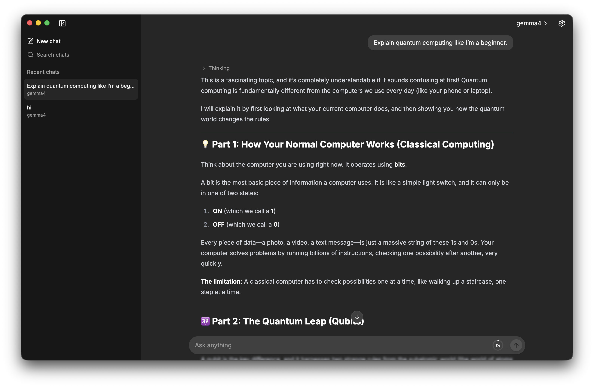

# Brane

Brane is a desktop app for chatting with large language models locally on your
computer. Your prompts, responses, chat history, and model files stay on your
device. Brane does not require a backend service to run your chats.

<p align="center">
	
	
</p>

## Table of contents

- [Early development](#early-development)
- [Build from source](#build-from-source)
- [What you need](#what-you-need)
- [Add a model](#add-a-model)
- [Features](#features)
- [Report a problem or request a feature](#report-a-problem-or-request-a-feature)
- [Privacy and model responsibility](#privacy-and-model-responsibility)
- [Acknowledgments](#acknowledgments)
- [License](#license)

## Early development

Brane is still early in development. Many features are not available yet, and
there is more work to do on performance, resource use, and general polish. The
app can be used as it is today, but bugs and unexpected behavior can occur.

Because of this early development stage, Brane is not currently planned for a
public release. You can still build and run the app from source by following
the [development setup instructions](CONTRIBUTING.md#development-setup).

Please report problems through the
[GitHub bug report form](https://github.com/andrejcode/brane/issues/new?template=bug_report.yml).

## Build from source

You need Node.js 22, npm, and Git.

```sh
git clone https://github.com/andrejcode/brane.git
cd brane
npm install
npm run build:mac
```

Distributable packages are written to `dist`. On macOS, open the generated DMG
and drag Brane to **Applications**. Builds created locally without an Apple
Developer ID are ad-hoc signed but not notarized, and are intended for personal
use.

Use `npm run build:win` on Windows or `npm run build:linux` on Linux. To run
Brane directly in development mode instead, use `npm run dev`. After building,
use `npm start` to preview the production bundles. See the [contribution
guide](CONTRIBUTING.md) for the complete development workflow.

## What you need

Brane does not include an AI model. Before chatting, you need to obtain a model
in **GGUF format**. Other model formats are not supported.

[Hugging Face](https://huggingface.co/models?library=gguf) is the recommended
place to find GGUF models. Model creators commonly offer several quantizations
of the same model. Quantization affects file size, memory use, speed, and output
quality, so read the model card and the creator's instructions before choosing
a file.

You are responsible for checking that your computer has enough memory and
appropriate hardware to run your chosen model. A larger model or context can
require considerably more RAM or unified memory than the model's file size. If
a model cannot be loaded, try a smaller model or a more compressed
quantization.

Brane does not currently estimate model compatibility for your system. A system
compatibility check and direct model downloads from within the app are planned
for a future release.

## Add a model

1. Download a `.gguf` model file from a source you trust.
2. Place the file in the `~/.brane/models` folder.
3. Open Brane and select **Models**.
4. Choose the model you want to load.
5. Start a new chat and send a message.

Brane watches the models folder while it is running, so newly added files should
appear automatically. If the folder does not exist yet, create it or launch
Brane once and let the app create it.

Brane remembers the selected model between launches but, by default, waits to
load it until you send a message. To keep the selected model ready immediately,
enable **Load selected model on startup** under **Settings > General**.

Each chat is associated with the model used to create it. If that model is
removed, the chat remains readable, but you cannot continue it until the same
model is available again. Replacing a model file with a different file under
the same name is also detected.

## Features

- Local, streamed conversations with GGUF models
- Persistent and searchable chat history
- Rename and delete conversations
- Stop generation at any time
- Display of supported model reasoning segments
- Optional message dates and generation statistics, including context usage,
  token speed, and stop reasons
- Markdown, code highlighting, tables, and math in responses
- Confirmation before opening links in an external browser
- Light, dark, and system themes
- Adjustable message font size
- Customizable keyboard shortcuts and send behavior, with shortcut hints in action tooltips
- Numbered shortcuts for opening the first nine chats, revealed by holding Cmd/Ctrl
- Optional loading of the selected model on startup
- English, German, Croatian, and Serbian interfaces
- Local diagnostic logs that you can open or delete from settings

## Report a problem or request a feature

Use the [bug report form](https://github.com/andrejcode/brane/issues/new?template=bug_report.yml)
for unexpected behavior and the
[feature request form](https://github.com/andrejcode/brane/issues/new?template=feature_request.yml)
for improvements or new capabilities. Search
[existing issues](https://github.com/andrejcode/brane/issues) first to avoid
duplicates.

Include clear reproduction steps, what you expected, what happened instead,
your Brane version, and your operating system in bug reports. Brane keeps local
diagnostic logs to help investigate errors. You can open the logs folder from
**Settings > General > Logs** and attach a relevant log file or excerpt to the
report. Brane does not intentionally log chat content, but logs can contain
local file paths and error details. GitHub issues are public, so review logs and
remove anything you do not want to share.

## Privacy and model responsibility

Brane runs inference and stores app data locally. It does not provide, host, or
distribute language models. Review the source, license, usage restrictions, and
privacy implications of every model you obtain.

By using Brane, you agree to the [Terms of Use](TERMS_OF_USE.md).

## Acknowledgments

Special thanks to my sister Ines Milanović for creating the Brane app icon.

## License

Brane is released under the [MIT License](LICENSE). Model files are separate
works and remain subject to their own licenses and terms.
